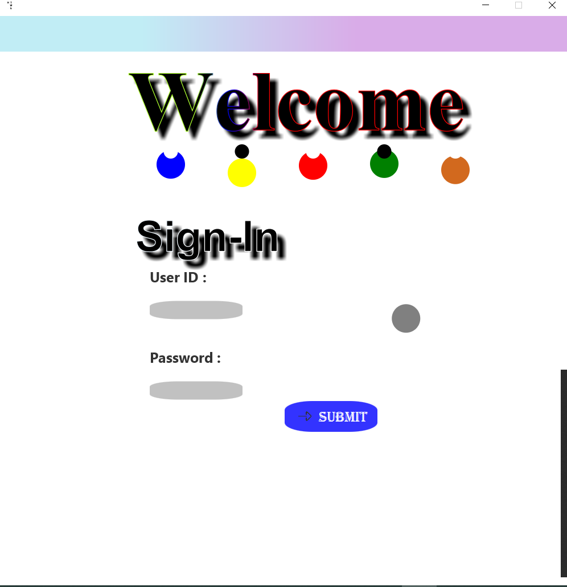
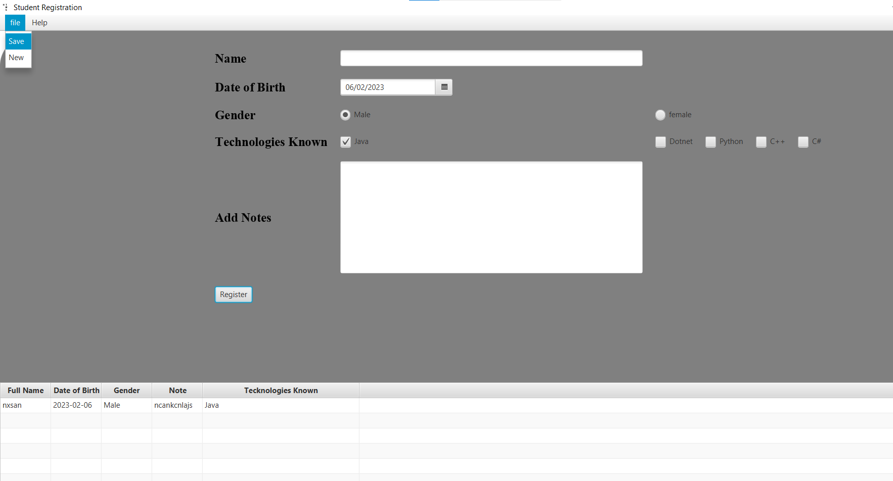

# Workers_Registration
__The application is made up of java jdk -17, it was created during my study periode__
## Views :
There are __Two Main Views__ which is : 

### __View1__ :

This View includes the login with Credentials which are : 

  __User_ID__ = __admin__ 

  __Password__ == __admin__

### __View2__ :

  

Within The second View we can create Instances of Users and Registrate them into the table.

The table could be lately saved into .txt document, which you must give the path to the file manually after clicking on save.

